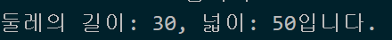

#  박세영 Class 기반 객체지향 연습문제

## 문제1.

앞 단원에서 수행한 연습문제 1,2번을 Class 기반의 객체지행으로 재구성하시오.

```js
class Student{
    constructor(kor,eng,math){
        this._kor= kor;
        this._eng= eng;
        this._math= math;
    }
    sum(){
        return this._kor+ this._eng+ this._math;
    }
    avg(){
       return this.sum() /3;
    }
};


const grade= [
    ["철수",92 ,81, 77],
    ["영희", 72, 95, 98],
    ["민혁", 80, 86, 84]
];

for (const item of grade){
    const s= new Student(item[1],item[2],item[3]);
    console.log("%s의 총점은 %d, 평균은 %d 입니다",
    item[0], s.sum(), s.avg());
}
```


```js

class Rectangle{
    constructor (){
        this._width = null;
        this._height= null;
    }
    get width(){
        return this._width;
    }
    set width(param){
        this._width= param;
    }
    get height(){
        return this._height;
    }
    set height(param){
        this._height= param;
    }
    getAround(){
        return this.width* 2+ this.height* 2;
    }
    getArea(){
        return this.width* this.height;
    }
}

const rect = new Rectangle();
rect.width= 10;
rect.height= 5;
console.log("둘레의 길이: %d, 넓이: %d입니다.",rect.getAround(), rect.getArea());
```

