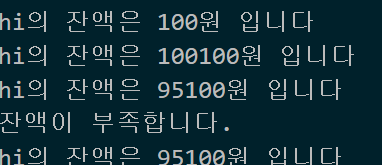

# 박세영 문제 풀이

문제 1 - 다음을 만족하는 Student 클래스를 작성하시오.

1. String형의 학과와 정수형의 학번을 프로퍼티로로 선언후 생성자를 통해 주입  →파라미터를 통해 멤버 변수에 넣는다.
2. getter, setter를 정의
3. sayHello() 메서드를 통해 "나는 OOOO학과 OO학번 입니다." 를 출력하는 기능을 구현

```js
class Student{
    constructor (h1, studno){
        this._h1= h1;
        this._studno= studno;
    }
    get Student(){
        return this._h1;
    }
    set Student(h1){
        this._h1= h1;
    }
    get Student(){
        return this._studno;
    }
    set Student(studno){
        this._studno= studno;
    }
    sayHello(){
        console.log("나는 %s학과 %d학번 입니다.",this._h1, this._studno);
    }
};

const user= new Student("디자인",103);
user.sayHello();
```


문제 - 2. 다음을 만족하는 클래스 Account를 작성하시오.

1. 다음의 2 개의 필드를 선언
문자열 owner; (이름)
숫자형 balance; (금액)
2. 위 모든 필드에 대한 getter와 setter의 구현
3. 위 모든 필드를 사용하는 가능한 모든 생성자의 구현
4. 메소드 deposit()의 헤드는 다음과 같으며 인자인 금액을 저축하는 메소드
deposit(amount)
5. 메소드 withdraw()의 헤드는 다음과 같으며 인자인 금액을 인출(리턴)하는 메소드
withdraw(long amount)
인출 상한 금액은 잔액까지로 하며, 이 경우 이러한 상황을 출력


```js

class Account{
    constructor(owner, balance){
    this._owner =owner;
    this._balance= balance;
    }
    get owner(){
        return this._owner;
    }
    set owner(param){
        this._owner=param;
    }
    get balance(){
        return this._balance;
    }
    set balance(param){
        this._owner=param;
    }
    deposit(amount){
        this._balance+=amount;
    }
    withdraw(amount){
        if (this._balance<amount)
        {console.log("잔액이 부족합니다.")
            return;}
        this._balance-=amount;
        return amount;
    }

}
const acc = new Account("hi", 100);

console.log("%s의 잔액은 %d원 입니다", acc.owner, acc.balance);


acc.deposit(100000);
console.log("%s의 잔액은 %d원 입니다", acc.owner, acc.balance);

acc.withdraw(5000);
console.log("%s의 잔액은 %d원 입니다", acc.owner, acc.balance);


acc.withdraw(10000000);
console.log("%s의 잔액은 %d원 입니다", acc.owner, acc.balance);

```

