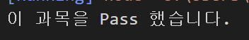

# 박세영 프로그램 흐름제어 연습문제

## 문제1

아래의 `switch문`을 `if문`으로 재작성 하시오.

```javascript
const 수학 = "B";

switch (수학) {
    case 'A':
    case 'B':
    case 'C':
        console.log("이 과목을 Pass 했습니다.");
        break;
    default:
        console.log("이 과목을 Pass하지 못했습니다.");
        break;
}
```

```javascript
const 수학 = "B";

if (수학=="A") {
    console.log("이 과목을 Pass 했습니다.");
} else if (수학 =="B") {
    console.log("이 과목을 Pass 했습니다.");
} else if (수학 =="C") {
    console.log("이 과목을 Pass 했습니다.");
} else {console.log("이 과목을 Pass하지 못했습니다.")
```

