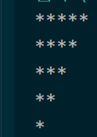

# 박세영 함수 연습문제

## 문제1.

아래의 형태로 출력하는 함수를 구현하시오.

```js
// max는 출력해야 할 최대 라인 수
function printStar(max) {
    ... 구현하세요 ...
}

printStar(5)
```

#### 출력결과

```
*
**
***
****
*****
```

```js
    function printStar(max){
        for( let i=0;i<max;i++){
            let str= "";
            for(let j=0; j<i+1; j++){
                str+="*";
            }
          console.log(str);
        }
    }
    printStar(5);
```


## 문제2.

1번 문제를 응용하여 같은 파라미터를 받았을 때 별을 역으로 출력하는 `printRevStar(max)` 을 구현하시오.


#### 출력결과

```
*****
****
***
**
*
```

```js
function printRevStar(max){
    for( let i=0;i<max;i++){
        let str= "";
        for(let j=0; j<max-i; j++){
            str+="*";
        }
      console.log(str);
    }
}
printRevStar(5);
```



## 문제3

369게임은 숫자를 순서대로 말하면서 3,6,9가 포함된 횟수만큼 박수를 치는 게임이다.

1부터 파라미터로 전달된 숫자까지 반복하면서 박수를 칠 조건이 충족되면 3,6,9 게임 규칙에 따라 박수를 의미하는 "짝"을 출력하고 그렇지 않은 경우에는 숫자를 출력하고, 박수를 총 몇번 쳤는지를 리턴하는 함수 `myGame(n)`을 작성하시오.

힌트: 문자열은 그 자체가 배열로 인식됩니다.

ex)
```js
const str = "Hello";
console.log(str[0]); // --> H
console.log(str[1]); // --> e
console.log(str[2]); // --> l
```

#### 출력예시

myGame(35)를 호출한 경우

```
1
2
짝(3) --> 1번
4
5
짝(6) --> 1번
7
8
짝(9) --> 1번
10
11
12
짝(13) --> 1번
14
15
...
짝(29) --> 1번
짝(30) --> 1번
짝(31) --> 1번
짝(32) --> 1번
짝짝(33) --> 2번
짝(34) --> 1번
짝(35) --> 1번

박수를 총 OO번 쳤습니다.
...

```

```js

function myGame(n){
    
    let x=0;
    for (let i=1; i<=n; i++){
        //i를 문자열로 변환
       
        const str= i+"" // 숫자를 문자열로 만들려면 빈문자열 +
        let say= "";
        let clap= 0;
        for(let j of str){
            if ("3"==j|| "6"==j || "9" ==j){
            say+= "짝";
            clap++;
            }
        }
        if (clap ==0){
            console.log(i);
        }else {
            console.log("%s (%d) -> %d번", say, i, clap);
            x+= clap;
        }
    }
console.log("박수를 총 %d번 쳤습니다.",x);
}
myGame(15);
```


## 문제4
문제1번을 화살표 함수가 적용된 재귀함수 기법으로 다시 구현해 보세요.

## 문제5
문제2번을 화살표 함수가 적용된 재귀함수 기법으로 다시 구현해 보세요