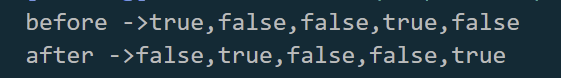

### 문제1

```js
var check_list = [true, false, false, true, false];
console.log("before ->" + check_list);

const a = parseInt(check_list.length/2);
for (let i =0; i<a; i++){
    const b = check_list.length -i -1
    
    const c =check_list[i];
    check_list[i] = check_list[b];
    check_list[b] = c;
}

console.log("after ->"+ check_list);
```




