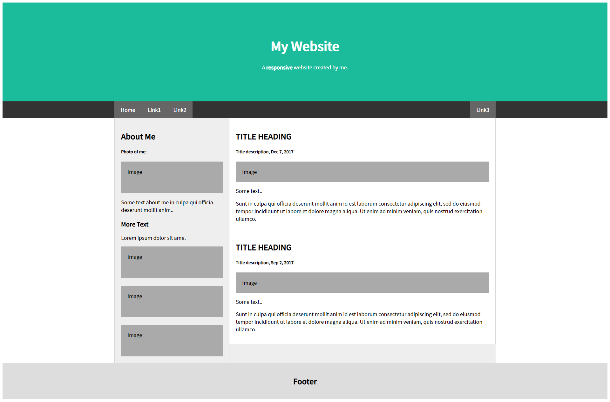

#  리액트 레이아웃 예제 - 박세영


## 구현 결과


## 코드

### index.js
```js
import React from "react";
import ReactDOM from "react-dom/client";
import { BrowserRouter } from "react-router-dom";
import App from "./App";

const root = ReactDOM.createRoot(document.getElementById("root"));
root.render(
  <React.StrictMode>
    <BrowserRouter>
      <App />
    </BrowserRouter>
  </React.StrictMode>
);

```


### App.js
```js
import React from "react";
import { Helmet } from "react-helmet";
import Header from "./component/Header";
import Footer from "./component/Footer";
import Content from "./page/Content";

function App() {
  const AppStyles= {
    fontFamily: 'Noto Sans KR',
    margin: '0',
    padding: '0'
  }
  return (
    <div style={AppStyles}>
      <Helmet>
        <meta charset="utf-8" />
        <title>22.04.28- 연습문제</title>
        <link rel="preconnect" href="https://fonts.googleapis.com" />
        <link rel="preconnect" href="https://fonts.gstatic.com" crossorigin />
        <link
          href="https://fonts.googleapis.com/css2?family=Gugi&family=Noto+Sans+KR:wght@100;300;400;500&display=swap"
          rel="stylesheet"
        />
      </Helmet>
      

      <Header/>
      <Content/>
      <Footer/>

    </div>
  );
}

export default App;

```

### component/Header.js
```js
import React from "react";
import styled from "styled-components";
import {NavLink} from "react-router-dom";

const HeaderStyles = styled.div`
  .header {
    .jumbotron {
      padding: 80px;
      text-align: center;
      background: #1abc9c;
      color: white;

      h1 {
        font-size: 40px;
      }
    }
  }
    .navbar {
      overflow: hidden;
      background-color: #333;
      position: sticky;
      top: 0;

      div {
        max-width: 1200px;
        margin: auto;
        display: flex;
        flex-direction: row;
        flex-wrap: nowrap;
        justify-content: flex-start;

        a {
          display: block;
          color: white;
          text-align: center;
          padding: 14px 20px;
          text-decoration: none;

          &.right {
            margin-left: auto;
          }
          &:hover {
            background-color: #ddd;
            color: black;
          }
          &.active {
            background-color: #666;
            color: white;
          }
        }
      }
    }
`;

const Header = () => {
  return (
    <HeaderStyles>
      <header className="header">
        <div className="jumbotron">
          <h1>My Website</h1>
          <p>
            A <b>responsive</b> website created by me.
          </p>
        </div>
      </header>
      <nav className="navbar">
        <div>
          <NavLink to="#" className="active">
            Home
          </NavLink>
          <NavLink to="#">Link1</NavLink>
          <NavLink to="#">Link2</NavLink>
          <NavLink to="#" className="right">
            Link3
          </NavLink>
        </div>
      </nav>
    </HeaderStyles>
  );
};

export default Header;

```

### page/Content.js
```js
import React from "react";
import Side from '../component/Side';
import Main from "../component/Main";
import styled from "styled-components";

const ContentItems= styled.div`
    max-width: 1200px;
    margin: auto;
    background-color: #eee;
    display: flex;
    flex-wrap: nowrap;
    flex-direction: row;
`;

const Content=() => {
  return (
    <ContentItems>
        <Side/>
        <Main/>
    </ContentItems>
  );
};

export default Content;

```

### component/Side.js
```js
import React from "react";
import styled from "styled-components";

const SideItem = styled.div`
  .side {
    width: 360px;
    flex: none;
    border-left: 1px solid #d5d5d5;
    border-right: 1px solid #d5d5d5;

    .container {
      padding: 20px;

      .fakeimg {
        background-color: #aaa;
        width: auto;
        padding: 20px;
        height: 60px;
        &:first-child{
          height: 200px;
        }
      }
    }
  }
`;

const Side = () => {
  return (
    <SideItem>
      <div className="side">
        <div className="container">
          <h2>About Me</h2>
          <h5>Photo of me:</h5>
          <div className="fakeimg">
            Image
          </div>
          <p>Some text about me in culpa qui officia deserunt mollit anim..</p>
          <h3>More Text</h3>
          <p>Lorem ipsum dolor sit ame.</p>
          <div className="fakeimg">
            Image
          </div>
          <br />
          <div className="fakeimg">
            Image
          </div>
          <br />
          <div className="fakeimg">
            Image
          </div>
        </div>
      </div>
    </SideItem>
  );
};

export default Side;

```

### component/Main.js
```js
import React from "react";
import styled from "styled-components";

const MainItem = styled.div`
  .main {
    flex: 0 1 auto;
    background-color: white;
    border-right: 1px solid #d5d5d5;

    .container {
      padding: 20px;

      .fakeimg {
        background-color: #aaa;
        width: auto;
        padding: 20px;
        height: 200pxl;
      }
    }
  }
`;

const Main = () => {
  return (
    <MainItem>
      <div className="main">
        <div className="container">
          <h2>TITLE HEADING</h2>
          <h5>Title description, Dec 7, 2017</h5>
          <div className="fakeimg">Image</div>
          <p>Some text..</p>
          <p>
            Sunt in culpa qui officia deserunt mollit anim id est laborum
            consectetur adipiscing elit, sed do eiusmod tempor incididunt ut
            labore et dolore magna aliqua. Ut enim ad minim veniam, quis nostrud
            exercitation ullamco.
          </p>
          <br />
          <h2>TITLE HEADING</h2>
          <h5>Title description, Sep 2, 2017</h5>
          <div className="fakeimg">Image</div>
          <p>Some text..</p>
          <p>
            Sunt in culpa qui officia deserunt mollit anim id est laborum
            consectetur adipiscing elit, sed do eiusmod tempor incididunt ut
            labore et dolore magna aliqua. Ut enim ad minim veniam, quis nostrud
            exercitation ullamco.
          </p>
        </div>
      </div>
    </MainItem>
  );
};

export default Main;

```

### component/Footer.js
```js
import React from "react";
import styled from "styled-components";

const FooterItem = styled.div`
    padding: 20px;
    text-align: center;
    background: #ddd;

`;

const Footer = () => {
  return (
    <FooterItem>
      <footer className="footer">
        <h2>Footer</h2>
      </footer>
    </FooterItem>
  );
};

export default Footer;

```