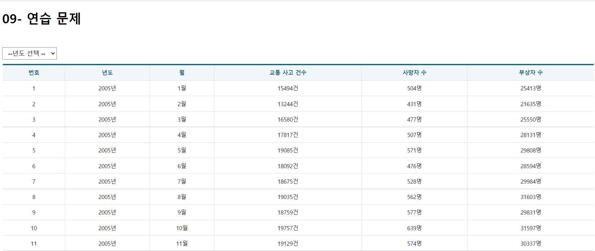
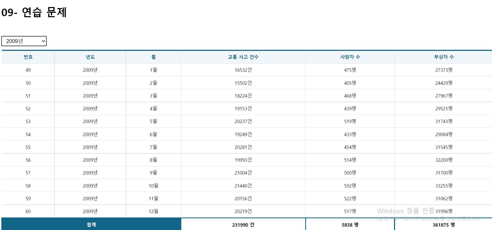

# 박세영 aiox-hooks 연습문제

## App.js

```js
import React from "react";
import styled from "styled-components";
import Spinner from "./components/Spinner";
import Table from "./components/Table";

//Axios 기능 제공 hooks
import useAxios from "axios-hooks";

//페이지 마운트 여부를 확인하기 위한 hook
import useMountedRef from "./hooks/useMounterRef";

//드롭다운을 배치하기 위한 박스
const SelectContainer = styled.div`
  position: sticky;
  top: 0;
  background-color: #fff;
  border-top: 1 solid #eee;
  border-bottom: 1px solid #eee;
  padding: 10px 0;
  margin: 0;
  select {
    margin-right: 15px;
    font-size: 16px;
    padding: 5px 10px;
  }
`;

function App() {
  const [{ data, loading, error }, refetch] = useAxios('http://localhost:3001/traffic_acc');
  //드롭다운의 선택 상태를 저장하기위한 상태 변수
  const [state, setState]= React.useState({year: ''});
  let sumAccident= 0;
  let sumDeath= 0;
  let sumInjury = 0;
  const mountedRef= useMountedRef();
  const onSelectChange= React.useCallback(e =>{
    e.preventDefault();

    //드롭다운 입력값 취득
    const current = e.target;
    const key= current.name;
    const value= current[current.selectedIndex].value;
    const newState= {...state, [key]: value};
    setState(newState);
    console.log(newState);
  },[state]);

  React.useEffect(()=>{
    if(mountedRef.current){
      const params= {};
      for(const key in state){
      if(state[key]){
        params[key]= state[key];
      }
    }
    refetch({params: params});
    }
  },[mountedRef, refetch, state]);
  if (error) {
    console.error(error);
    return (
      <div>
        <h1>Error!! :: {error.code}</h1>
        <hr />
        <p>{error.message}</p>
      </div>
    );
  }
  return (
    <div>
      <h1> 09- 연습 문제</h1>
      <br/>
        {/*로딩바 */}
        <Spinner visible={loading} />
      {/*검색 조건 드롭다운 박스 - select의 name속성의 값은 상태값에 저장된 json의 key와 동일함*/}
      <SelectContainer>
        <select name="year" onChange={onSelectChange}>
          <option value=''> --년도 선택 -- </option>
          <option value='2005'> 2005년 </option>
          <option value='2006'> 2006년 </option>
          <option value='2007'> 2007년 </option>
          <option value='2008'> 2008년 </option>
          <option value='2009'> 2009년 </option>
          <option value='2010'> 2010년 </option>
          <option value='2011'> 2011년 </option>
          <option value='2012'> 2012년 </option>
          <option value='2013'> 2013년 </option>
          <option value='2014'> 2014년 </option>
          <option value='2015'> 2015년 </option>
          </select>
      </SelectContainer>
      <Table>
        <thead>
          <th>번호</th>
          <th>년도</th>
          <th>월</th>
          <th>교통 사고 건수</th>
          <th>사망자 수</th>
          <th>부상자 수</th>
        </thead>
        <tbody>
        {data &&
            data.map(
              ({id, year, month, accident, death, injury},i) => {
                sumAccident += accident;
                sumDeath += death;
                sumInjury += injury;
                return(
              <tr key={id}>
                <td>{id}</td>
                <td>{year}년</td>
                <td>{month}월</td>
                <td>{accident}건</td>
                <td>{death}명</td>
                <td>{injury}명</td>
              </tr>
            );}
        )}
        <tr key='sum' style={{fontWeight:'bolder'}}>
          <td colSpan='3' style={{color:'white',border: '3px solid #168', backgroundColor:'#168'}}>합계</td>
          <td style={{border: '3px solid #168'}}>{sumAccident} 건</td>
          <td style={{border: '3px solid #168'}}>{sumDeath} 명</td>
          <td style={{border: '3px solid #168'}}>{sumInjury} 명</td>
        </tr>
        </tbody>
      </Table>
    </div>
  );
}

export default App;
```

## 다른 컴포넌트들은 axios-hooks수업과 동일함

## 구현 결과

### 초기 화면



### 년도 선택 시

