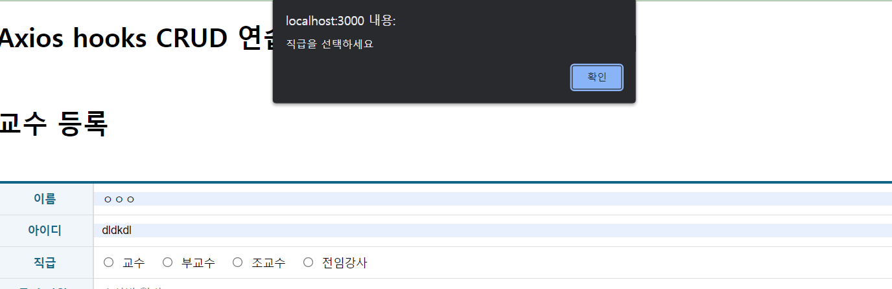

# 연습 문제 11 박세영

## DOM 구조


*components파일들과 excptions, libs는 실습 내용과 같습니다.*

---


## Index.js


```js
import React from 'react';
import ReactDOM from 'react-dom/client';
import {BrowserRouter} from 'react-router-dom';
import App from './App';

const root = ReactDOM.createRoot(document.getElementById('root'));
root.render(
  <BrowserRouter>
    <App />
  </BrowserRouter>
);

```


---


## App.js


```js
import React from 'react';
import {Routes, Route} from 'react-router-dom';

import PropessorAdd from './pages/PropessorAdd';
import PropessorList from './pages/PropessorList';
import PropessorEdit from './pages/PropessorEdit';

function App() {
  return (
    <>
      <h1> Axios hooks CRUD 연습문제</h1>
      <br />
      <Routes>
        <Route path="/" export={true} element={<PropessorList/>}/>
        <Route path='/add' element={<PropessorAdd/>}/>
        <Route path='/edit/:id' element={<PropessorEdit/>}/>
      </Routes>
    </>
  );
}

export default App;

```


---


## PropessorList.js


```js
import React from "react";
import useAxios from "axios-hooks";
import styled from "styled-components";
import { NavLink } from "react-router-dom";
import dayjs from "dayjs";

import Spinner from "../components/Spinner";
import Table from "../components/Table";

const LinkContainer = styled.div`
  position: sticky;
  top: 0;
  background-color: #fff;
  border-top: 1px solid #eee;
  border-bottom: 1px solid #eee;
  padding: 10px 0;
`;

const TopLink = styled(NavLink)`
  margin-top: 15px;
  display: inline-block;
  font-size: 16px;
  padding: 7px 10px 5px 10px;
  color: #fff;
  text-decoration: none;
  background-color: #168;
  &:hover {
    background-color: #124f60;
  }
`;

const PropessorList = () => {
  //화면에 표시할 교수 목록 데이터를 저장하기 위한 상태 변수
  const [professor, setProfessor] = React.useState([]);

  //백엔드로부터 데이터 불러오기 - 자체 캐시기능 방지
  const [{ data, loading, error }, refetch] = useAxios(
    "http://localhost:3001/professor",
    {
      useCache: false,
    }
  );
  React.useEffect(()=>{
      setProfessor(data);
  },[data])

  //백엔드로부터 데이터 삭제하기
  const [{ loading2 }, sendDelete] = useAxios(
    {
      method: "DELETE",
    },
    {
      useCache: false,
      manual: true, //수동 전송
    }
  );

  //삭제 버튼 클릭시 호출될 이벤트 핸들러
  const onDeleteClick = (e) => {
    e.preventDefault();

    //이벤트가 발생한 대상을 가져옴
    const current = e.target;

    //클릭된 링크에 숨겨져잇는 dataset의 일련번호와 교수 이름 가져오기
    const id = parseInt(current.dataset.id);
    //알림창에 쓸 이름값
    const name = current.dataset.name;

    //삭제확인
    if (window.confirm(`정말 ${name}을 삭제하시겠습니까?`)) {
      (async () => {
        let json = null;
        try {
          const response = await sendDelete({
            method: "Delete",
            url: `http://localhost:3001/professor/${id}`,
          });
          json = response.data;
        } catch (e) {
          console.error(e);
          window.alert(
            `[${e.response.status}] ${e.response.statusText}\n${e.message}`
          );
        }
        if (json != null) {
          setProfessor((grade) => grade.filter((v, i) => v.id !== id));
        }
      })();
    }
  };

  //axios-hooks에의해 생성된 상태값 data가 변경되었을때 실행될 hook
  React.useEffect(() => {
    setProfessor(data);
  }, [data]);

  return (
    <>
      <Spinner visible={loading || loading2} />
      <LinkContainer>
        <TopLink to="add">교수 등록하기</TopLink>
      </LinkContainer>
      {error ? (
        <div>
          <h1> {error.code} Error </h1>
          <hr />
          <p>{error.message}</p>
        </div>
      ) : (
        <Table>
          <thead>
            <tr>
              <th>No.</th>
              <th>이름</th>
              <th>아이디</th>
              <th>직급</th>
              <th>급여</th>
              <th>입사일</th>
              <th>보직수당</th>
              <th>소속학과번호</th>
              <th>수정</th>
              <th>삭제</th>
            </tr>
          </thead>
          <tbody>
            {professor &&
              professor.map(
                (
                  { id, name, userid, position, sal, hiredate, comm, deptno },
                  i
                ) => {
                  return (
                    <tr key={id}>
                      <td>{id}</td>
                      <td>{name}</td>
                      <td>{userid}</td>
                      <td>{position}</td>
                      <td>
                        {sal} {sal ? "만원" : ""}
                      </td>
                      <td>{dayjs(`${hiredate}`).format("YYYY-MM-DD")}</td>
                      <td>
                        {comm} {comm ? "만원" : ""}
                      </td>
                      <td>{deptno}</td>
                      <td>
                        <NavLink
                          to={`edit/${id}`}
                          style={{ textDecoration: "none", color: "green" }}
                        >
                          수정하기
                        </NavLink>
                      </td>
                      <td>
                        {/*클릭시 클릭된 항목의 id와 name값을 뽑아옴 */}
                        <a
                          href="#!"
                          data-id={id}
                          data-name={name}
                          style={{ textDecoration: "none", color: "red" }}
                          onClick={onDeleteClick}
                        >
                          삭제 하기
                        </a>
                      </td>
                    </tr>
                  );
                }
              )}
          </tbody>
        </Table>
      )}
    </>
  );
};

export default PropessorList;

```


---


## PropessorAdd.js


```js
import React from "react";

import useAxios from "axios-hooks";
import styled from "styled-components";
import { useNavigate } from "react-router-dom";

import Spinner from "../components/Spinner";
import Table from "../components/Table";

import regexHelper from "../libs/RegexHelper";

//Table컴포넌트의 css를 확장한 컴포넌트
const TableEx = styled(Table)`
  margin-top: 50px;
  margin-bottom: 15px;
  .inputWrapper {
    padding: 0;
    position: relative;
    text-align: left;
    .field {
      box-sizing: border-box;
      display: block;
      left: 0;
      top: 0;
      width: 100%;
      height: 100%;
      border: 0;
      padding: 0 10px;
      outline: none;
      font-size: 14px;
    }
    label {
      margin-left: 7px;
      margin-right: 10px;
      input {
        margin-right: 10px;
      }
    }
  }
`;

const PropessorAdd = () => {
  //저장 완료 후 목록으로 되돌아가기 위한 페이지 강제 이동 함수 생성
  const navigate = useNavigate();

  //백엔드에 데이터 저장을 위한 ajax요청 객체 생성- 메뉴얼 전송 모드
  const [{ loading }, refetch] = useAxios(
    {
      url: "http://localhost:3001/professor",
      method: "POST",
    },
    { manual: true }
  );
  const [{ data, loading: loading2, error }] = useAxios(
    "http://localhost:3001/department"
  );

  //form태그의 submit버튼이 눌러졌을때 호출될 이벤트 핸들러
  const onSubmit = React.useCallback((e) => {
    e.preventDefault();

    //이벤트가 발생한 폼 객체
    const current = e.target;

    //입력값에 대한 유효성 검사
    try {
      regexHelper.value(current.name, "이름을 입력하세요");
      regexHelper.kor(current.name, "이름은 한글로 입력하세요");
      regexHelper.minLength(
        current.name,
        2,
        "이름은 최소 2글자 이상 입력해야 합니다"
      );
      regexHelper.maxLength(
        current.name,
        10,
        "이름은 최대 10글자까지 입력 가능합니다"
      );
      regexHelper.value(current.userid, "아이디를 입력하세요.");
      regexHelper.engNum(
        current.userid,
        "아이디는 영문과 숫자조합으로만 가능합니다"
      );
      regexHelper.minLength(
        current.userid,
        2,
        "아이디는 최소 2글자 이상 입력해야 합니다"
      );
      regexHelper.maxLength(
        current.userid,
        20,
        "아이디는 최대 20글자까지 입력 가능합니다"
      );
      regexHelper.check(current.position, "직급을 선택하세요");
      regexHelper.value(current.sal, "급여를 입력하세요");
      regexHelper.value(current.sal, "급여는 숫자만 입력 가능합니다");
      regexHelper.value(current.hiredate, "입사일을 입력하세요");
      regexHelper.value(current.comm, "보직 수당을 입력하세요");
      regexHelper.value(current.comm, "보직 수당은 숫자만 입력 가능합니다");
      regexHelper.value(current.deptno, "소속 학과를 선택하세요");
    } catch (e) {
      window.alert(e.message);
      e.field.focus();
      return;
    }
    //입력받은 값 취득
    const name = current.name.value;
    const userid = current.userid.value;
    const position = current.position.value;
    const sal = current.sal.value;
    const hiredate = current.hiredate.value;
    const comm = current.comm.value;
    const deptno = current.deptno.value;

    let json = null;

    (async () => {
      try {
        const response = await refetch({
          data: {
            name: name,
            userid: userid,
            position: position,
            sal: sal,
            hiredate: hiredate,
            comm: comm,
            deptno: deptno,
          },
        });
        json = response.data;
      } catch (e) {
        console.error(e);
        window.alert(
          `[${e.response.status}] ${e.response.statusText} \n${e.message}`
        );
      }
      if (json != null) {
        window.alert("저장되었습니다.");
        navigate("/");
      }
    })();
  }, []);
  return (
    <>
      <Spinner visible={loading || loading2} />
      <h1>교수 등록</h1>
      <form onSubmit={onSubmit}>
        <TableEx>
          <colgroup>
            <col width="120" />
            <col />
          </colgroup>
          <tbody>
            <tr>
              <th>이름</th>
              <td className="inputWrapper">
                <input type="text" className="field" name="name" />
              </td>
            </tr>
            <tr>
              <th>아이디</th>
              <td className="inputWrapper">
                <input type="text" className="field" name="userid" />
              </td>
            </tr>
            <tr>
              <th>직급</th>
              <td className="inputWrapper">
                <label>
                  <input type="radio" name="position" value="교수" />
                  교수
                </label>
                <label>
                  <input type="radio" name="position" value="부교수" />
                  부교수
                </label>
                <label>
                  <input type="radio" name="position" value="조교수" />
                  조교수
                </label>
                <label>
                  <input type="radio" name="position" value="전임강사" />
                  전임강사
                </label>
              </td>
            </tr>
            <tr>
              <th>급여(만원)</th>
              <td className="inputWrapper">
                <input
                  type="number"
                  className="field"
                  name="sal"
                  placeholder="숫자만 입력"
                />
              </td>
            </tr>
            <tr>
              <th>입사일</th>
              <td className="inputWrapper">
                <input type="date" className="field" name="hiredate" />
              </td>
            </tr>
            <tr>
              <th>보직수당(만원)</th>
              <td className="inputWrapper">
                <input
                  type="number"
                  className="field"
                  name="comm"
                  placeholder="숫자만 입력"
                />
              </td>
            </tr>
            <tr>
              <th>소속학과</th>
              <td className="inputWrapper">
                <select className="field" name="deptno">
                  <option value=""> -- 선택하세요 -- </option>
                  {data &&
                    data.map((v, i) => {
                      return (
                        <option key={i} value={v.id}>
                          {v.dname}
                        </option>
                      );
                    })}
                </select>
              </td>
            </tr>
          </tbody>
        </TableEx>
        <div style={{ textAlign: "center" }}>
          <button type="submit">저장하기</button>
        </div>
      </form>
    </>
  );
};
export default PropessorAdd;

```


---


## PropessorEdit.js


```js
import React from "react";

import useAxios from "axios-hooks";
import styled from "styled-components";
import { useNavigate, useParams } from "react-router-dom";
import dayjs from "dayjs";

import regexHelper from "../libs/RegexHelper";

import Spinner from "../components/Spinner";
import Table from "../components/Table";

//Table컴포넌트의 css를 확장한 컴포넌트
const TableEx = styled(Table)`
  margin-top: 50px;
  margin-bottom: 15px;
  .inputWrapper {
    padding: 0;
    position: relative;
    text-align: left;
    .field {
      box-sizing: border-box;
      display: block;
      left: 0;
      top: 0;
      width: 100%;
      height: 100%;
      border: 0;
      padding: 0 10px;
      outline: none;
      font-size: 14px;
    }
    label {
      margin-left: 7px;
      margin-right: 10px;
      input {
        margin-right: 10px;
      }
    }
  }
`;

const PropessorEdit = () => {
  //path파라미터로 전달된 일련 번호
  const { id } = useParams();

  //데이터 수정후 목록 페이지로 강제 이동하기 위한 함수
  const navigate = useNavigate();

  const [{ data: department, loading: loading2, error: error2 }] = useAxios(
    "http://localhost:3001/department"
  );

  //수정할 대상을 백엔드로부터 로드- 자동 실행모드
  const [{ data, loading, error }, refresh] = useAxios(
    `http://localhost:3001/professor/${id}`
  );

  const onSubmit = React.useCallback((e) => {
    e.preventDefault();

    //이벤트가 발생한 폼 객체
    const current = e.target;

    //입력값에 대한 유효성 검사
    try {
      regexHelper.value(current.name, "이름을 입력하세요");
      regexHelper.kor(current.name, "이름은 한글로 입력하세요");
      regexHelper.minLength(
        current.name,
        2,
        "이름은 최소 2글자 이상 입력해야 합니다"
      );
      regexHelper.maxLength(
        current.name,
        10,
        "이름은 최대 10글자까지 입력 가능합니다"
      );
      regexHelper.value(current.userid, "아이디를 입력하세요.");
      regexHelper.engNum(
        current.userid,
        "아이디는 영문과 숫자조합으로만 가능합니다"
      );
      regexHelper.minLength(
        current.userid,
        2,
        "아이디는 최소 2글자 이상 입력해야 합니다"
      );
      regexHelper.maxLength(
        current.userid,
        20,
        "아이디는 최대 20글자까지 입력 가능합니다"
      );
      regexHelper.check(current.position, "직급을 선택하세요");
      regexHelper.value(current.sal, "급여를 입력하세요");
      regexHelper.value(current.sal, "급여는 숫자만 입력 가능합니다");
      regexHelper.value(current.hiredate, "입사일을 입력하세요");
      regexHelper.value(current.comm, "보직 수당을 입력하세요");
      regexHelper.value(current.comm, "보직 수당은 숫자만 입력 가능합니다");
      regexHelper.value(current.deptno, "소속 학과를 선택하세요");
    } catch (e) {
      window.alert(e.message);
      e.field.focus();
      return;
    }
    //입력받은 값 취득
    const name = current.name.value;
    const userid = current.userid.value;
    const position = current.position.value;
    const sal = current.sal.value;
    const hiredate = current.hiredate.value;
    const comm = current.comm.value;
    const deptno = current.deptno.value;

    let json = null;
    //입력, 수정, 삭제 처리
    (async () => {
      try {
        const response = await refresh({
          method: "PUT",
          data: {
            name: name,
            userid: userid,
            position: position,
            sal: sal,
            hiredate: hiredate,
            comm: comm,
            deptno: deptno,
          },
        });
        json = response.data;
      } catch (e) {
        console.error(e);
        window.alert(
          `[${e.response.status}] ${e.response.statusText} \n${e.message}`
        );
      }
      if (json != null) {
        window.alert("수정되었습니다.");
        navigate("/");
      }
    })();
  }, []);
  return (
    <>
      <Spinner visible={loading || loading2} />
      {error || error2 ? (
        <div>
          <h1>{error.code} Error!!</h1>
          <hr />
          <p>{error.message}</p>
        </div>
      ) : (
        //ajax를 통해 조회한 결과가 존재할 때만 데이터를 표시함
        data && (
          <form onSubmit={onSubmit}>
            <TableEx>
              <colgroup>
                <col width="120" />
                <col />
              </colgroup>
              <tbody>
                <tr>
                  <th>이름</th>
                  <td className="inputWrapper">
                    <input
                      type="text"
                      className="field"
                      name="name"
                      defaultValue={data.name}
                    />
                  </td>
                </tr>
                <tr>
                  <th>아이디</th>
                  <td className="inputWrapper">
                    <input
                      type="text"
                      className="field"
                      name="userid"
                      defaultValue={data.userid}
                    />
                  </td>
                </tr>
                <tr>
                  <th>직급</th>
                  <td className="inputWrapper">
                    <label>
                      <input
                        type="radio"
                        name="position"
                        value="교수"
                        defaultChecked={data.position === "교수"}
                      />
                      교수
                    </label>
                    <label>
                      <input
                        type="radio"
                        name="position"
                        value="부교수"
                        defaultChecked={data.position === "부교수"}
                      />
                      부교수
                    </label>
                    <label>
                      <input
                        type="radio"
                        name="position"
                        value="조교수"
                        defaultChecked={data.position === "조교수"}
                      />
                      조교수
                    </label>
                    <label>
                      <input
                        type="radio"
                        name="position"
                        value="전임강사"
                        defaultChecked={data.position === "전임강사"}
                      />
                      전임강사
                    </label>
                  </td>
                </tr>
                <tr>
                  <th>급여(만원)</th>
                  <td className="inputWrapper">
                    <input
                      type="number"
                      className="field"
                      name="sal"
                      defaultValue={data.sal}
                      placeholder="숫자만 입력"
                    />
                  </td>
                </tr>
                <tr>
                  <th>입사일</th>
                  <td className="inputWrapper">
                    <input
                      type="date"
                      className="field"
                      name="hiredate"
                      defaultValue={dayjs(`${data.hiredate}`).format(
                        "YYYY-MM-DD"
                      )}
                    />
                  </td>
                </tr>
                <tr>
                  <th>보직수당(만원)</th>
                  <td className="inputWrapper">
                    <input
                      type="number"
                      className="field"
                      name="comm"
                      defaultValue={data.comm}
                      placeholder="숫자만 입력"
                    />
                  </td>
                </tr>
                <tr>
                  <th>소속학과</th>
                  <td className="inputWrapper">
                    <select
                      className="field"
                      name="deptno"
                      defaultValue={data.deptno}
                    >
                      <option value=""> -- 선택하세요 -- </option>
                      {department &&
                        department.map((v, i) => {
                          return (
                            <option key={i} value={v.id}>
                              {v.dname}
                            </option>
                          );
                        })}
                    </select>
                  </td>
                </tr>
              </tbody>
            </TableEx>
            <div style={{ textAlign: "center" }}>
              <button type="submit">저장하기</button>
            </div>
          </form>
        )
      )}
    </>
  );
};

export default PropessorEdit;

```


---


## 출력 결과

*유효성 검사시 등록 페이지와 수정 페이지가 같은 결과이기 때문에 등록 페이지에만 출력 결과를 첨부했습니다*


### 초기 화면


### Add

**이름 입력을 하지 않았을시**


**이름 입력시 한글이 아닐 경우**


**이름 입력시 최소 글자수나 최대 글자수가 맞지 않을 경우**


최소 글자수


최대 글자수


**ID를 입력하지 않았을 경우**


**ID 입력시 최소 글자수나 최대 글자수가 맞지 않을 경우**


최소 글자수


최대 글자수


**ID입력시 영문과 숫자가 아닐 경우**


**직급을 선택하지 않았을 경우**





**급여를 입력하지 않았을 경우**


**급여 입력시 숫자가 아닐 경우**


**입사일을 입력하지 않았을 경우**


**보직수당을 입력하지 않았을 경우**


**보직수당 입력시 숫자가 아닐 경우**


**소속학과를 선택하지 않았을 경우**


**교수 등록시**


저장된 목록


저장된 데이터 파일


### Edit


**수정 페이지**


**교수 수정시**


**수정된 목록**


### Delete


**삭제 버튼 클릭시**


**삭제 후 목록**


**삭제 후 데이터 파일**


