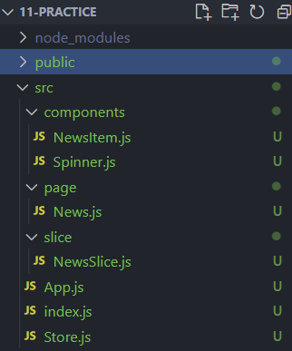
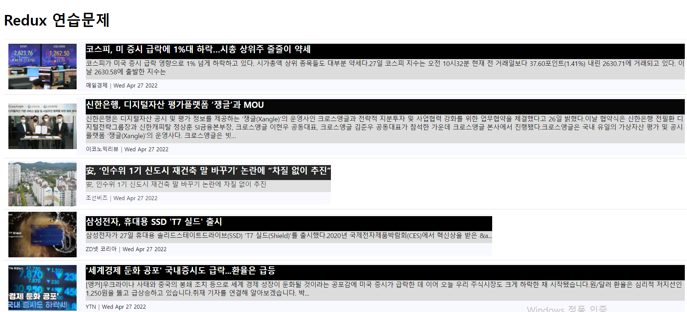

# Redux 뉴스 목록 연습문제 - 박세영

## DOM 구조




---


## 출력 결과




---


## components

**NewsItem.js**
05-stylesheet단원의 '/components/NewsItem.js'를 재사용함

**Spinner.js**
실습시 사용한 파일 재사용함


---


## index.js

```js
import React from 'react';
import ReactDOM from 'react-dom/client';
import App from './App';
import {BrowserRouter} from 'react-router-dom';

//리덕스 구성을 위한 참조
import { Provider } from 'react-redux';
import store from './Store';


const root = ReactDOM.createRoot(document.getElementById('root'));
root.render(
  <BrowserRouter>
  <Provider store={store}>
    <App />
  </Provider>
  </BrowserRouter>
);


```


---


## App.js

```js
import React from 'react';
import News from './page/News';

function App() {
  return (
    <div >
      <h1> Redux 연습문제 </h1>
      <News/>
    </div>
  );
}

export default App;

```


---


## Store.js

```js
import { configureStore } from '@reduxjs/toolkit';

import NewsSlice from './slice/NewsSlice';

const store= configureStore({
    reducer: {
        news: NewsSlice
    },
    devtools: true
});

export default store;
```


---


## slice

### NewsSlice.js

```js
import {createSlice, createAsyncThunk} from '@reduxjs/toolkit';
import axios from 'axios';

//비동기 처리 함수  구현- ajax요청을 위한 함수
export const getList= createAsyncThunk('news/getList', async(payload, {rejectWithValue})=>{
    let result= null;
    try{
        result = await axios.get('http://localhost:3001/news');
    }catch(e){
        result= rejectWithValue(e.response)
    }
    return result;  //ajax 연동 결과를 리턴
});

//slice 정의 (action함수+ reducer의 개념)
//ajax의 처리결과를 관리할 상태값 정의
const newsSlice= createSlice({
    name: 'news',
    initialState:{
        data: null,         //ajax처리를 통해 수신된 데이터
        loading: false,     //로딩 여부
        error: null         //에러 정보
    },
    extraReducers:{     // ajax연동기능을 호출할때 사용
        [getList.pending]: (state, {payload})=>{        //로딩중-기존의 상태값 복사후 로딩만 true로 바꿈
            return {...state, loading: true}
        },
        [getList.fulfilled]: (state, {payload})=>{      //ajax완료-성공
            return{
                data: payload?.data,    //payload가(ajax결과가) 존재할때만 data에 접근함
                loading: false,
                error: null
            }
        },
        [getList.rejected]: (state, {payload})=>{       //에러
            return{
                data: payload?.data,
                loading: false,
                error:{
                    code: payload?.status ? payload.status : 500,
                    message: payload?.statusText ? payload.statusText : 'Server Error'
                }
            }
        }
    }
});

//리듀서 객체 내보네기
export default newsSlice.reducer;
```

---


## page

### News.js

```js
import React from "react";
import styled from "styled-components";

import Spinner from "../components/Spinner";
import NewsItem from "../components/NewsItem";

//상태값을 로드하기위한 hook과 action함수를 dispatch할 hook 참조
import { useSelector, useDispatch } from "react-redux";
//slice에 정의된 액션 함수들 참조
import { getList } from "../slice/NewsSlice";

//05-stylesheet단원의 '/components/NewsList.js'를 붙여넣기함
const ListContainer = styled.ul`
  list-style: none;
  padding: 0;
  margin: 0;
  width: 100%;
  box-sizing: border-box;
  display: flex;
  flex-direction: column;
  margin-bottom: 30px;
`;

const News = () => {
  //컴포넌트가 마운트될때 콘솔의 모든 내용 삭제- 출력결과가 복잡해지는것을 방지
  React.useEffect(() => console.clear(), []);

  //hook을 통해 slice가 관리하는 상태값 가져오기
  const { data, loading, error } = useSelector((state) => state.news);

  const dispatch = useDispatch();

  //컴포넌트가 마운트되면 데이터 조회를 위한 액션함수를 다스패치함
  React.useEffect(() => {
    dispatch(getList());
  }, [dispatch]);
  return (
    <div>
      <Spinner visible={loading} />
      {error ? (
        <div>
          <h1> ERROR!! {error.code}</h1>
          <hr />
          <p>{error.message}</p>
        </div>
      ) : (
        <ListContainer>
          {data && data.map((v, i) => <NewsItem key={i} item={v} />)}
        </ListContainer>
      )}
    </div>
  );
};

export default News;

```