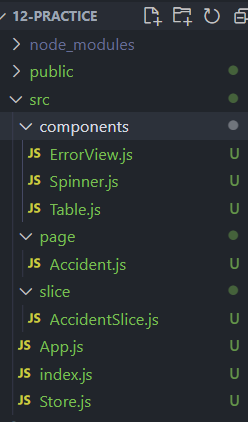
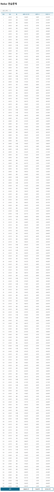
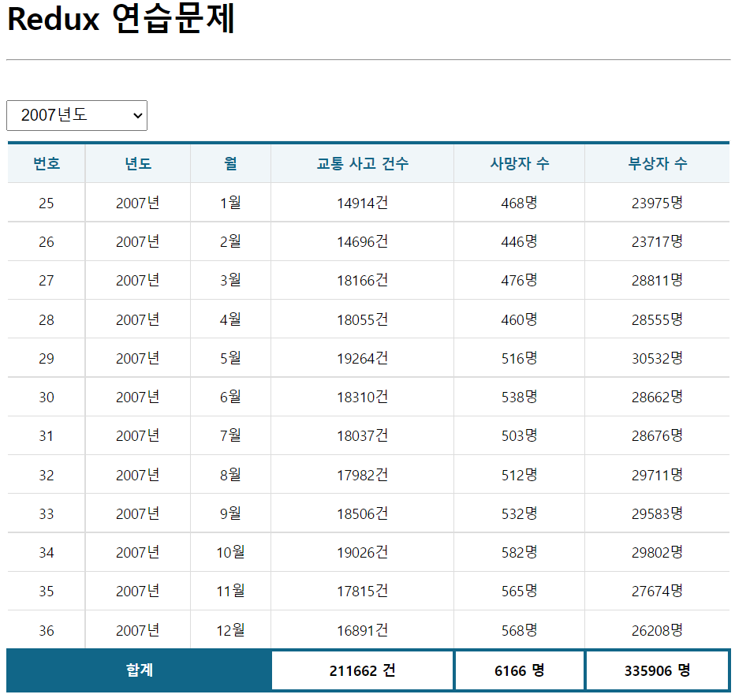

# Redux- 교통사고 현황 연습 문제 - 박세영

## DOM구조



---

## App.js

```js
import React from 'react';
import Accident from './page/Accident';


function App() {
  return (
    <div >
      <h1> Redux 연습문제 </h1>
      <hr />
      <br/>
      <Accident/>
    </div>
  );
}

export default React.memo(App);

```

---

## AccidentSlice.js

```js
import {createSlice, createAsyncThunk} from '@reduxjs/toolkit';
import axios from 'axios';

//비동기 처리 함수  구현- ajax요청을 위한 함수
export const accidentList= createAsyncThunk('accident/accidentList', async(payload, {rejectWithValue})=>{
    let result= null;
    try{
        result = await axios.get('http://localhost:3001/traffic_acc',{
            params:{
                //payload로 params전달..
                year: payload?.year
            }
        });
    }catch(e){
        result= rejectWithValue(e.response)
    }
    return result;  //ajax 연동 결과를 리턴
});

//slice 정의 (action함수+ reducer의 개념)
//ajax의 처리결과를 관리할 상태값 정의
const accidentSlice= createSlice({
    name: 'accident',
    initialState:{
        data: null,         //ajax처리를 통해 수신된 데이터
        loading: false,     //로딩 여부
        error: null         //에러 정보
    },
    extraReducers:{     // ajax연동기능을 호출할때 사용
        [accidentList.pending]: (state, {payload})=>{        //로딩중-기존의 상태값 복사후 로딩만 true로 바꿈
            return {...state, loading: true}
        },
        [accidentList.fulfilled]: (state, {payload})=>{      //ajax완료-성공
            return{
                data: payload?.data,    //payload가(ajax결과가) 존재할때만 data에 접근함
                loading: false,
                error: null
            }
        },
        [accidentList.rejected]: (state, {payload})=>{       //에러
            return{
                data: payload?.data,
                loading: false,
                error:{
                    code: payload?.status ? payload.status : 500,
                    message: payload?.statusText ? payload.statusText : 'Server Error'
                }
            }
        }
    }
});

//리듀서 객체 내보네기
export default accidentSlice.reducer;
```

---


## Store.js

```js
import { configureStore, getDefaultMiddleware } from '@reduxjs/toolkit';

import accidentSlice from './slice/AccidentSlice';

const store= configureStore({
    reducer: {
        accident: accidentSlice
    },
    middleware: [...getDefaultMiddleware({serializableCheck: false})],
    devtools: true
});

export default store;
```

---


## Accident.js

```js
import React, { memo } from "react";
import styled from "styled-components";

import Spinner from "../components/Spinner";
import Table from "../components/Table";
import ErrorView from "../components/ErrorView";

//상태값을 로드하기위한 hook과 action함수를 dispatch할 hook 참조
import { useSelector, useDispatch } from "react-redux";
//slice에 정의된 액션 함수들 참조
import { accidentList } from "../slice/AccidentSlice";

//드롭다운을 배치하기 위한 박스
const SelectContainer = styled.div`
  position: sticky;
  top: 0;
  background-color: #fff;
  border-top: 1 solid #eee;
  border-bottom: 1px solid #eee;
  padding: 10px 0;
  margin: 0;
  select {
    margin-right: 15px;
    font-size: 16px;
    padding: 5px 10px;
  }
`;

const Accident = memo(() => {
  React.useEffect(() => console.clear(), []);
  const { data, loading, error } = useSelector((state) => state.accident);
  const [year, setYear] = React.useState();
  const dispatch = useDispatch();

  let sumAccident = 0;
  let sumDeath = 0;
  let sumInjury = 0;

  React.useEffect(() => {
    dispatch(accidentList({year: year}));
  }, [dispatch, year]);
  const onSelectChange = React.useCallback((e) => {
    e.preventDefault();
    //드롭다운 입력값 취득
    const current = e.target;
    const value = current[current.selectedIndex].value;
    setYear(value);
  }, []);

  return (
    <div>
      <Spinner visible={loading} />
      <SelectContainer>
        <select name="year" onChange={onSelectChange}>
          <option value=""> -- 년도 선택 -- </option>
          {[...new Array(2018 - 2005 + 1)].map((v, i) => {
            return (
              <option key={i} value={2005 + i}>
                {2005 + i}년도
              </option>
            );
          })}
        </select>
      </SelectContainer>
      {error ? (
        <ErrorView error={error} />
      ) : (
        <Table>
          <thead>
            <th>번호</th>
            <th>년도</th>
            <th>월</th>
            <th>교통 사고 건수</th>
            <th>사망자 수</th>
            <th>부상자 수</th>
          </thead>
          <tbody>
            {data &&
              data.map(({ id, year, month, accident, death, injury }, i) => {
                sumAccident += accident;
                sumDeath += death;
                sumInjury += injury;
                return (
                  <tr key={id}>
                    <td>{id}</td>
                    <td>{year}년</td>
                    <td>{month}월</td>
                    <td>{accident}건</td>
                    <td>{death}명</td>
                    <td>{injury}명</td>
                  </tr>
                );
              })}
            <tr key="sum" style={{ fontWeight: "bolder" }}>
              <td
                colSpan="3"
                style={{
                  color: "white",
                  border: "3px solid #168",
                  backgroundColor: "#168",
                }}
              >
                합계
              </td>
              <td style={{ border: "3px solid #168" }}>{sumAccident} 건</td>
              <td style={{ border: "3px solid #168" }}>{sumDeath} 명</td>
              <td style={{ border: "3px solid #168" }}>{sumInjury} 명</td>
            </tr>
          </tbody>
        </Table>
      )}
    </div>
  );
});

export default Accident;

```

---


### components 폴더안의 파일들과 index.js는 이전 제출물과 같습니다.


---

## 출력 결과

### 초기 화면




### 년도 선택시

