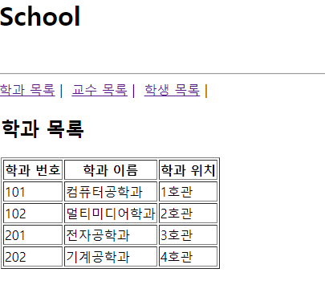
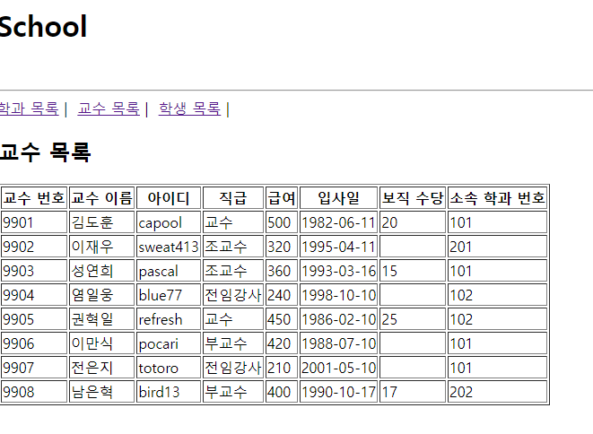
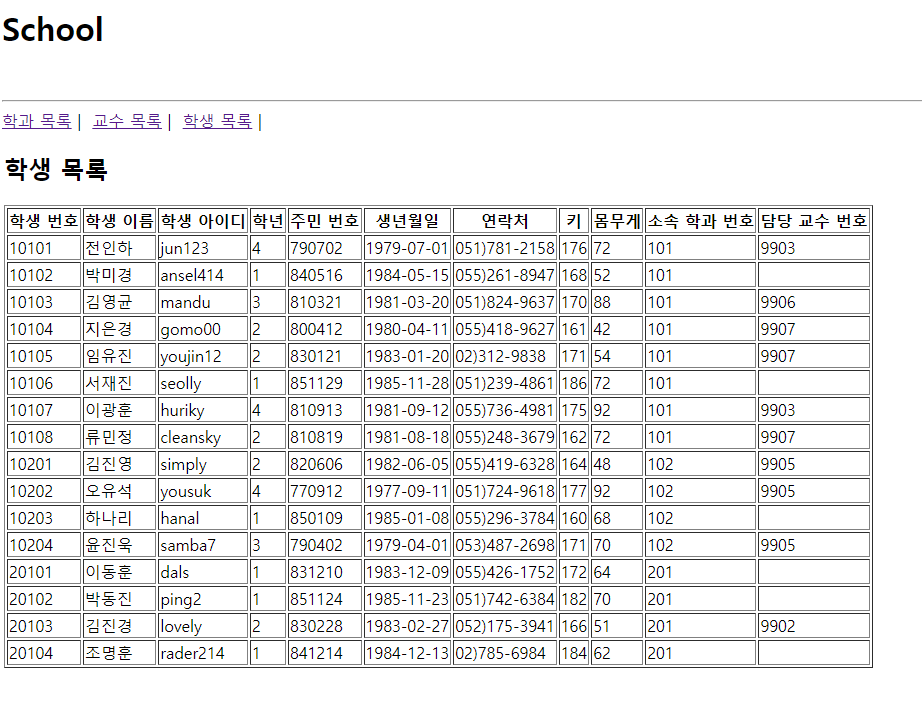

# 리액트 컴포넌트 예제- 박세영

## 코드

### index.js

```js
import React from "react";
import ReactDOM from "react-dom/client";
import App from "./App";
import { BrowserRouter } from "react-router-dom";

const root = ReactDOM.createRoot(document.getElementById("root"));
root.render(
  <React.StrictMode>
    <BrowserRouter>
      <App />
    </BrowserRouter>
  </React.StrictMode>
);
```

### App.js

```js
import React from "react";
import { Link, Routes, Route } from "react-router-dom";
import Department from "./school/Department";
import Professor from "./school/Professor";
import Student from "./school/Student";

function App() {
  return (
    <div className="App">
      <h1> School </h1>
      <br />
      <hr />
      <nav>
        <Link to="/Department">학과 목록</Link> | &nbsp;
        <Link to="/Professor">교수 목록</Link> | &nbsp;
        <Link to="/Student">학생 목록</Link> | &nbsp;
      </nav>
      <table>
        <Routes>
          <Route path="/Department" element={<Department />} />
          <Route path="/Professor" element={<Professor />} />
          <Route path="/Student" element={<Student />} />
        </Routes>
      </table>
    </div>
  );
}

export default App;
```

### Department.js

```js
import React from "react";
import School from "../myschool.json";
const Department = () => {
  const DepartmentItem = ({ id, dname, loc }) => {
    return (
      <tr>
        <td>{id}</td>
        <td>{dname}</td>
        <td>{loc}</td>
      </tr>
    );
  };
  return (
    <div>
      <h2>학과 목록</h2>
      <table border="1">
        <thead>
          <th>학과 번호</th>
          <th>학과 이름</th>
          <th>학과 위치</th>
        </thead>
        <tbody>
          {School.department.map((v, i) => {
            return (
              <DepartmentItem key={i} id={v.id} dname={v.dname} loc={v.loc} />
            );
          })}
        </tbody>
      </table>
    </div>
  );
};

export default Department;
```

### Professor.js

```js
import React from "react";
import School from "../myschool.json";

const Professor = () => {
  const ProfessorItem = ({
    id,
    name,
    userid,
    position,
    sal,
    hiredate,
    comm,
    deptno,
  }) => {
    return (
      <tr>
        <td>{id}</td>
        <td>{name}</td>
        <td>{userid}</td>
        <td>{position}</td>
        <td>{sal}</td>
        <td>{hiredate}</td>
        <td>{comm}</td>
        <td>{deptno}</td>
      </tr>
    );
  };
  return (
    <div>
      <h2>교수 목록</h2>
      <table border="1">
        <thead>
          <th>교수 번호</th>
          <th>교수 이름</th>
          <th>아이디</th>
          <th>직급</th>
          <th>급여</th>
          <th>입사일</th>
          <th>보직 수당</th>
          <th>소속 학과 번호</th>
        </thead>
        <tbody>
          {School.professor.map((v, i) => {
            return (
              <ProfessorItem
                key={i}
                id={v.id}
                name={v.name}
                userid={v.userid}
                position={v.position}
                sal={v.sal}
                hiredate={v.hiredate.substring(0, 10)}
                comm={v.comm}
                deptno={v.deptno}
              />
            );
          })}
        </tbody>
      </table>
    </div>
  );
};

export default Professor;
```

### Student.js

```js
import React from "react";
import School from "../myschool.json";

const Student = () => {
  const StudentItem = ({
    id,
    name,
    userid,
    grade,
    idnum,
    birthdate,
    tel,
    height,
    weight,
    deptno,
    profno,
  }) => {
    return (
      <tr>
        <td>{id}</td>
        <td>{name}</td>
        <td>{userid}</td>
        <td>{grade}</td>
        <td>{idnum}</td>
        <td>{birthdate}</td>
        <td>{tel}</td>
        <td>{height}</td>
        <td>{weight}</td>
        <td>{deptno}</td>
        <td>{profno}</td>
      </tr>
    );
  };

  return (
    <div>
      <h2>학생 목록</h2>
      <table border="1">
        <thead>
          <th>학생 번호</th>
          <th>학생 이름</th>
          <th>학생 아이디</th>
          <th>학년</th>
          <th>주민 번호</th>
          <th>생년월일</th>
          <th>연락처</th>
          <th>키</th>
          <th>몸무게</th>
          <th>소속 학과 번호</th>
          <th>담당 교수 번호</th>
        </thead>
        <tbody>
          {School.student.map((v, i) => {
            return (
              <StudentItem
                key={i}
                id={v.id}
                name={v.name}
                userid={v.userid}
                grade={v.grade}
                idnum={v.idnum.substring(0, 6)}
                birthdate={v.birthdate.substring(0, 10)}
                tel={v.tel}
                height={v.height}
                weight={v.weight}
                deptno={v.deptno}
                profno={v.profno}
              />
            );
          })}
        </tbody>
      </table>
    </div>
  );
};

export default Student;
```

## 구현 결과

### 학과 목록


### 교수 목록


### 학생 목록
